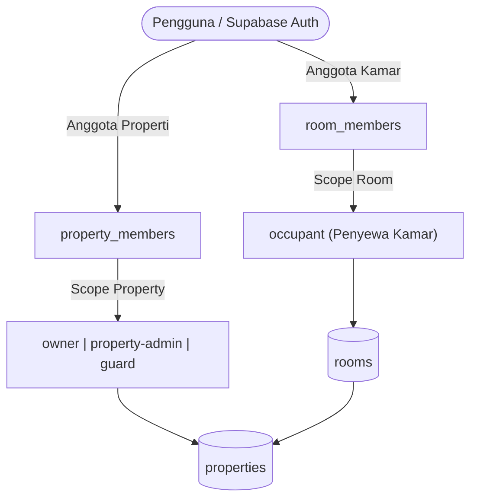

# Arsitektur Sistem My Indekos

Dokumentasi arsitektur sistem, model data, otorisasi peran bertingkat, dan data flow aplikasi `fe-my-indekos`.

## 1. Domain & Scope Produk
`fe-my-indekos` difokuskan spesifik untuk pengelolaan dan pencarian properti kos-kosan (`property_type: 'kosan'`). Aplikasi ini terhubung ke instance database Supabase yang sama dengan platform induk (Property Management System / PMS).

## 2. Model Peran Bertingkat (Role Scoping)

Sistem membedakan batasan wewenang berdasarkan lingkup (scope) entitas:

### A. Lingkup Properti (`property_members`)
- **Owner**: Pemilik properti. Memiliki wewenang penuh (menambah kamar, persetujuan sewa, input PLN & PDAM, hapus data).
- **Property-admin**: Pengelola operasional dengan wewenang administratif serupa owner.
- **Guard**: Penjaga kos. Akses terbatas (melihat ketersediaan kamar dan utilitas tanpa wewenang mutasi data finansial).

### B. Lingkup Kamar (`room_members`)
- **Occupant**: Penyewa kamar. Memiliki akses melihat detail kamar sewaannya dan mencatat token PLN mandiri.

### C. Dukungan Peran Ganda (Dual Role)
Satu akun pengguna dapat menjadi Owner (memiliki properti) sekaligus Occupant (menyewa kamar di properti sendiri atau milik orang lain). Dashboard menyediakan tampilan terpisah:
1. **Properti yang Saya Kelola** (dihitung berdasarkan kepemilikan di `properties` / `property_members`).
2. **Kamar yang Saya Sewa** (dihubungkan via `room_members`).

## 3. Aliran Data Utama (Key Workflows)

### A. Pengajuan Sewa & Penempatan Kamar oleh Owner
1. Calon penyewa mengajukan sewa dari katalog `/properties`:
   - **Pilih Kamar Tertentu**: Calon penghuni langsung menentukan unit kamar kosong yang diminati.
   - **Skip Pilih Kamar**: Menyerahkan penempatan unit kamar kepada pemilik kos.
2. Pada alur *Skip Pilih Kamar*, ketika Owner menekan **Setujui Sewa** di Dashboard:
   - Muncul **Modal Pemilihan Kamar Kosong**.
   - Owner memilih kamar yang akan ditempati calon penyewa.
   - API `/api/rooms/respond` mendaftarkan pengguna ke `room_members` dan menautkan `occupant_member_id` ke kamar.
   - Penghuni menerima notifikasi konfirmasi berisi kamar yang telah ditentukan.

### B. Manajemen & Riwayat Utilitas (`utility_payments`)
- Tabel `utility_payments` mencatat konsumsi listrik (PLN) dan air (PDAM).
- **PLN**: Dapat dicatat oleh penyewa kamar (`occupant`) maupun pengelola (`owner`/`property-admin`).
- **PDAM**: Hanya dapat dicatat dan diubah oleh pengelola (`owner`/`property-admin`).
- Dashboard dan halaman kamar menyinkronkan status utilitas secara realtime melalui Supabase Postgres Changes.

## 4. Keamanan & Konvensi Teknis
- **Next.js App Router (React 19)**: Dynamic route parameters wajib diakses secara asynchronous (`const { id } = await params`).
- **Supabase SSR**: Menggunakan cookie-based session management (`@supabase/ssr`) terisolasi antara Server Component (`lib/supabase/server.ts`) dan Client Component (`lib/supabase/client.ts`).
- **Username Change Rule**: Pembatasan 24 jam sekali diverifikasi pada level database via stored procedure/RPC `change_username`.
